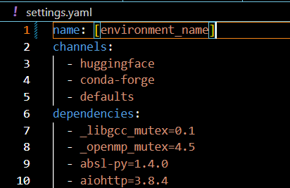

# README.md
This repository provides the code, data, and results of the paper titled *"Analyzing the Controllability of Language Models and Improving the Control Performance with Reward Dropout."*

<br/>

# Set-up

To use our code, first **clone this repository.** Then, **make your conda environment align with ours** by importing `settings.yaml` as below code:
```
# create a new Conda environment named [environment_name].
conda create -n [environment_name] python=3.10.8 -y

# activate the created Conda environment.
conda activate [environment_name]

# update the created Conda environment with `settings.yaml` configurations.
# Note that the name & prefix keys in `settings.yaml` must be edited first.
conda env update --file settings.yaml --prune
```
You have to wait for a while to create conda enviroment from `settings.yaml`. Be sure to use ``--prune`` option since it deletes all the dependencies not contained in `settings.yaml` and forces the created Conda environment to strictly follow the dependencies of `settings.yaml`.

Note that the values of **'name'** key in `settings.yaml` file must be editted based on your **\[environment_name\]** before running the code above. **name** key refers to the name of new conda environment to be created based on ``settings.yaml``.



## *"Found conflicts!"* error
When running the codes above returns *"Found conflicts!"* error, please running the below code before ``conda env update --file settings.yaml --prune``. Then, the error may be resolved:
```
# force the channel_priority configuration of conda environment to false.
conda config --set channel_priority false
```

## In case you have conflict to set up Conda environment.
After importing `settings.yaml`, editting the **name** key, and resolving *'Found conflicts* error right way, if your environment still has conflict, then it is probably because a version of your NVIDIA driver or CUDA does not align with the versions of `tensorflow-gpu` and `transformers` dependencies in `settings.yaml`. So, please force the installation of specific version as below:
```
conda install -c conda-forge tensorflow-gpu=2.10.0 -y
conda install -c conda-forge tensorflow-probability -y
conda install -c huggingface transformers=4.28.1 -y
```

<br/>
<br/>

# 10-turn positioning game
You can *reproduce the 10-turn positioning game* described in the paper by running the below codes:

### 1) Generating the simulated data
You need to **generate the position change history of behavior agent.** 

To  do that, running the code below:
```
python3 pos_game_data.py --mode=gen --num_epi=5000 --min_reward_action=6 --reward_order=16
```
- *``--mode=gen`` option indicates that 10-turn positioning game is simulated to generate the episodes, i.e., trajectories, of behavior agent.*
- *``--num_epi=5000`` option configures the total number of simulated episodes to be 5000.*
- *``--min_reward_action=6`` option configures the 10-turn positioning game where rewards are only collectable at positions from 6 to 10. Note that the position is defined as an integer number between 0 to 10.*
- *``--reward_order=16`` option shapes the reward distribution to follow 16 ($= 2^4$)-th order function.* 

Since the 10-turn positioning game forces the length of episode to be 10, the total number of position changes for the behavior agent is $50000 (= 10 \times 5000)$. 

In addition, as described in the paper, we tested 6 cases by different parameters of behavior policy, i.e., different combinations of $\mu$ and $\sigma$, so the total size of data increases up to $300000 (= 50000 \times 6$).

### 2) Training a target agent on the simulated data
You need to **train a target agent according to the position change history of behavior agent.**

To  do that, running the code below:
```
CUDA_VISIBLE_DEVICES=0 python3 train_pos_game_agent.py --batch_size=1 --lr=1e-05 --num_epoch=1 --case=0 --min_reward_action=6 --reward_order=16

CUDA_VISIBLE_DEVICES=0 python3 train_pos_game_agent.py --batch_size=1 --lr=1e-05 --num_epoch=1 --case=1 --min_reward_action=6 --reward_order=16

CUDA_VISIBLE_DEVICES=0 python3 train_pos_game_agent.py --batch_size=1 --lr=1e-05 --num_epoch=1 --case=2 --min_reward_action=6 --reward_order=16

CUDA_VISIBLE_DEVICES=0 python3 train_pos_game_agent.py --batch_size=1 --lr=1e-05 --num_epoch=1 --case=3 --min_reward_action=6 --reward_order=16

CUDA_VISIBLE_DEVICES=0 python3 train_pos_game_agent.py --batch_size=1 --lr=1e-05 --num_epoch=1 --case=4 --min_reward_action=6 --reward_order=16

CUDA_VISIBLE_DEVICES=0 python3 train_pos_game_agent.py --batch_size=1 --lr=1e-05 --num_epoch=1 --case=5 --min_reward_action=6 --reward_order=16
```
or
```
sh train_pos_game_agent.sh
```

- *``--batch_size=1`` option sets the batch size of the target agent to be 1e-05.*
- *``--lr=1e-05`` option sets the learning rate of the target agent to be 1e-05.*
- *``--num_epoch=1`` option sets the number of training epoch for the target agent to be 1.*
- *``--case=0`` option determines the simulated data of specific behavior agent to be learned by the target agent. In other words, it specifies the pre-defined combination of $\mu$ and $\sigma$ of the behavioral agent that the target agent will learn from. Since only 6 cases are considered in the paper, the 0, 1, 2, 3, 4, and 5 arguments are allowed for this option.*
- *``--min_reward_action=6`` option specifies that the target agent will be trained on the simulated data where rewards are only collectable at positions from 6 to 10.*
- *``--reward_order=16`` option specifies that the target agent will be trained on the simulated data where reward distribution follows 16 ($= 2^4$)-th order function.*

Note that you can change ``CUDA_VISIBLE_DEVICES=0`` command depending on the GPU availability in your server.

### 3) Evaluating target agent's policy
After training, evaluate the target agent's policy by initializing its position to a random state and running it to play a 10-turn positioning game. 

To  do that, running the code below:
```
CUDA_VISIBLE_DEVICES=0 python3 evaluate_pos_game_agent.py --batch_size=1 --lr=1e-05 --num_epoch=1 --case=0 --min_reward_action=6 --reward_order=16

CUDA_VISIBLE_DEVICES=0 python3 evaluate_pos_game_agent.py --batch_size=1 --lr=1e-05 --num_epoch=1 --case=1 --min_reward_action=6 --reward_order=16

CUDA_VISIBLE_DEVICES=0 python3 evaluate_pos_game_agent.py --batch_size=1 --lr=1e-05 --num_epoch=1 --case=2 --min_reward_action=6 --reward_order=16

CUDA_VISIBLE_DEVICES=0 python3 evaluate_pos_game_agent.py --batch_size=1 --lr=1e-05 --num_epoch=1 --case=3 --min_reward_action=6 --reward_order=16

CUDA_VISIBLE_DEVICES=0 python3 evaluate_pos_game_agent.py --batch_size=1 --lr=1e-05 --num_epoch=1 --case=4 --min_reward_action=6 --reward_order=16

CUDA_VISIBLE_DEVICES=0 python3 evaluate_pos_game_agent.py --batch_size=1 --lr=1e-05 --num_epoch=1 --case=5 --min_reward_action=6 --reward_order=16

```
or
```
sh evaluate_pos_game_agent.sh
```

### 4) Plotting the results
Now, you need to draw the resulting plots, i.e., the action or position distribution of the target agent.

To  do that, running the code below:
```
CUDA_VISIBLE_DEVICES=0 python3 pos_game_data.py --mode=test --num_epi=5000 --batch_size=1 --lr=1e-05 --num_epoch=1 --min_reward_action=6 --reward_order=16
```
Running this code will generate a file named *"figure1_1e-05_1_5_mra=6_ro=16.pdf"* that reproduces Figure 2(b) in the paper.

### 5) Conducting additional analysis
We have analyzed the dynamics of target agent given the behavior agent (behavior policy) is fixed while the different reward distribution was set up according to the power of 2 at $i \in [1, 10]$.

To visualize the result of analysis, running the code below:
```
sh plot_additional_analysis.sh
```
Running this code will generate a file named *"4col_figure1_1e-05_1_5_mra=1_ro=16.pdf"* that reproduces Figure 3 in the paper.

Note that $i \in [1, 10]$ sets all positions from 1 to 10 as rewarding positions. However, as the reward distribution becomes more and more skewed, that is, as the order of the reward function increases, some positions turn into zero-reward positions where the reward converges to zero.

<br/>
<br/>

# Benchmark Experiments
You can *reproduce the benchmark experiments* described in the paper by running the below codes:

## 1) Preparing datasets
For benchmark experiments, first download the ``datasets.tar.gz``, ``pretrained_weights.tar.gz``, and ``weights.tar.gz`` in our [Google Drive](https://drive.google.com/drive/folders/1qOWjtDq8Ry2QRdKZvyGzSetFF-lggz7M?usp=drive_link). After then, store and unzip them at the corresponding folders named ``prep_data``, ``pretrained_weights``, and ``weights``, respectively, as below:
```
# After store the zipped files downloaded from Google drive, then unzip them into the corresponding folders.

# unzip datasets.tar.gz into prep_data folder.
cd ./prep_data              # move to prep_data directory.
tar -zxvf datasets.tar.gz   # unzip datasets.tar.gz file.

# unzip pretrained_weights.tar.gz into pretrained_weights folder.
cd ./pretrained_weights                 # move to pretrained_weights directory.
tar -zxvf pretrained_weights.tar.gz     # unzip pretrained_weights.tar.gz file.

# unzip weights.tar.gz into weights folder.
cd ./weights                    # move to weights directory.
tar -zxvf weights.tar.gz        # unzip datasets.tar.gz file.
```

Note that for Google Drive capacity reasons, *weights.tar.gz* only provides a zipped file of the weights for the hyperparameter settings below:
- dataset : *sentiment*, *topic*, *emtion*
- decoding : *stochastic*
- dropout : *quantile*
- dropout rate : *0.95*

Even with these limited settings, it will take some time to download ``weights.tar.gz``, save and upzip it to the weights folder.

Also note that we provide ``pretrained_weights.tar.gz`` as zipped file for your convenience, but you can download it directly from Huggingface:
```
# import GPT2 tokenizer.
gpt2_tokenizer = AutoTokenizer.from_pretrained("gpt2",
                                                bos_token=BOS, eos_token=EOS, unk_token='<unk>', pad_token=PAD, mask_token = MASK, sep_token = SEP,
                                                padding="max_length", truncation=True, padding_side='right')

# import GPT2 model.
gpt2_model = TFAutoModelForCausalLM.from_pretrained("gpt2")
```
<!-- Once you downloaded and saved our dataset the right way, create conda environment by importing `settings.yaml` as below:
```
conda env create -f settings.yaml
``` -->

## 2) Running models
After completing preparing datasets, running the below code reproduces Tables 1 and 2 in the paper.
```
sh evaluate_LLM.sh
```
Note that the *weights.tar.gz* file contains only limited settings (as mentioned in *preparing datasets* step), so ``sh evaluate_LLM.sh`` will only reproduce Tables 1 and 2 for those settings.

## 3) Plotting the results
```
sh plot_train_reward_all.sh
```

## 4) Training models
#literate-engine
